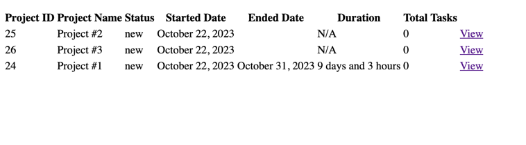

<p align="center">
<a href="https://github.com/mnalbantov/task_management/actions"></a>
</p>

## Overview

This is Symfony API skeleton based project, created for sake of demonstration purposes for Paynetics.

Technologies used in this project

- Docker
- PostgresSQL 12
- Symfony 6
- Doctrine
- PHP 8
- CI/CD (GitHub Actions)

## Getting started

1. This service works with <a href="https://docker.com">Docker</a> for containerization of the app.
2. Make sure you have Docker installed on your machine

To start the service and installation setup use the following command

```
sh bin/init.sh
```

This command will pull necessary images and build your containers.
It will create the project and setup your initial required configuration.
Once you are done,you should enter into your PHP container (e.g ``docker compose exec php``)

and run ``composer install`` in root folder.

Make sure to edit your `DATABASE_URL` with actual IP address or container name.

# Migrations  & Fixtures

In order to run the necessary migrations, enter into your PHP container:

- `bin/console doctrine:migrations:migrate`

If you want to load some example project entries, run:

- `bin/console doctrine:fixtures:load`

If you successfully built the project, you can check if it's up & running on
http://localhost:8080/health-check

If you see `The app is configured & working properly!` you are ready to go.

## Project Structure

The project structure is trying to follow Symfony one and based mainly on 
- Events 
- DTOs
- Entities & Repositories
- Services
- Event Listeners & Subscribers
- Exception Handlers 
- Validators
- Migrations & Fixtures
- Custom Query Paginator & Knp Paginator

## Workflow 
1. As Project is created, it's with **New** status by default.
2. Task can be created/assigned only for opened projects (_i.e not failed or completed_).
3. When task is created/updated it's reflect on Project status and time frame.
4. - Task status is updated to **In Progress** and End date is set for the task. 
   - The project overall timeframe has been updated, based on the tasks.
5. If task is updated, but deadline for the project is missed, it will automatically mark as Failed.
6. **Done** is considered as all the Project  tasks are completed in time.
7. Duration represents the time frame in tasks for particular project.
_Not used Forms & FormTypes neither built-in Symfony Form Request Handler & Twig template engine_
## Endpoints & Examples

- Web View based endpoints


http://localhost:8080/web/projects/ [GET] list of projects

http://localhost:8080/web/projects/25/tasks [GET] list of tasks per project

- API Based Endpoints

For sake of simplicity you can use the provided endpoints and insert cURL
examples into GUI tool like Postman

```
  projects_list      GET /projects/                
  projects_view      GET /projects/{id}            
  projects_tasks     GET /projects/{id}/tasks      
  projects_create    POST /projects/create          
  tasks_create       POST /tasks/create             
  tasks_update       PATCH /tasks/{id}/update        
  tasks_delete       DELETE /tasks/{id}/delete      
```

[GET] http://localhost:8080/projects - paginated results with 20 records by default

[GET] http://localhost:8080/projects?resultsPerPage=2&page=2 - paginated results with custom page & limit

Create project example [POST] - cURL

```
curl --location 'http://localhost:8080/projects/create' \
--header 'Content-Type: application/json' \
--data '{
    "title": "Project #10",
    "description": "My Awesome Project",
    "userType": "company",
    "startDate": "2023-10-22 01:00:00",
    "endDate": "2023-10-30 16:00:00"
}'
```

Create task for specific Project [POST] - cURL

```
curl --location 'http://localhost:8080/tasks/create' \
--header 'Content-Type: application/json' \
--data '{
    "title": "Task #13",
    "description": "some text here",
    "projectId": 4,
    "endDate": "2023-10-23 00:00:00"
}'
```

Update task for specific Project [PATCH] - cURL

```
curl --location --request PATCH 'http://localhost:8080/tasks/19/update' \
--header 'Content-Type: application/json' \
--data '{
    "title": "Task #13",
    "description": "some Edited text here",
    "projectId": 4,
    "status": "in_progress",
    "startDate": "2022-10-23 00:00:00",
    "endDate": "2023-10-25 00:00:00"
}'
```

[Success] Example Response

```
{
    "code": 0,
    "data": {
        "id": 19,
        "title": "Task #13",
        "description": "some text here",
        "status": "new",
        "project_id": 4,
        ...
    },
    "status": "success"
}
```

[Error] Example Response

```
{
    "code": -1,
    "data": [],
    "validation_errors": {
        "status": [
            "The value \"ins_progress\" is not valid task status."
        ]
    }
}

OR

{
    "code": -1,
    "data": [],
    "status": "not_found"
}
```

[DELETE] Task http://localhost:8080/tasks/19/delete

## Security 
 
The security of the packages is maintained by GH Actions and vulnerability package checker.

## Testing & code quality

There's no significant unit tests in this project.
The code convention practices are based on PSR rules

- PHP CS Fixer (Symfony)
- PHPStan